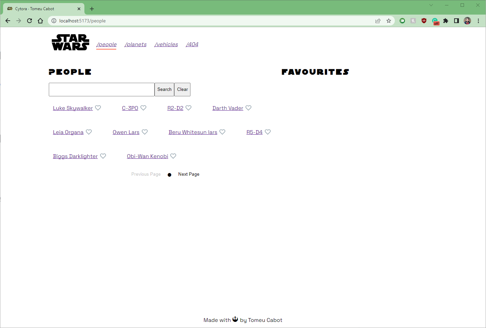
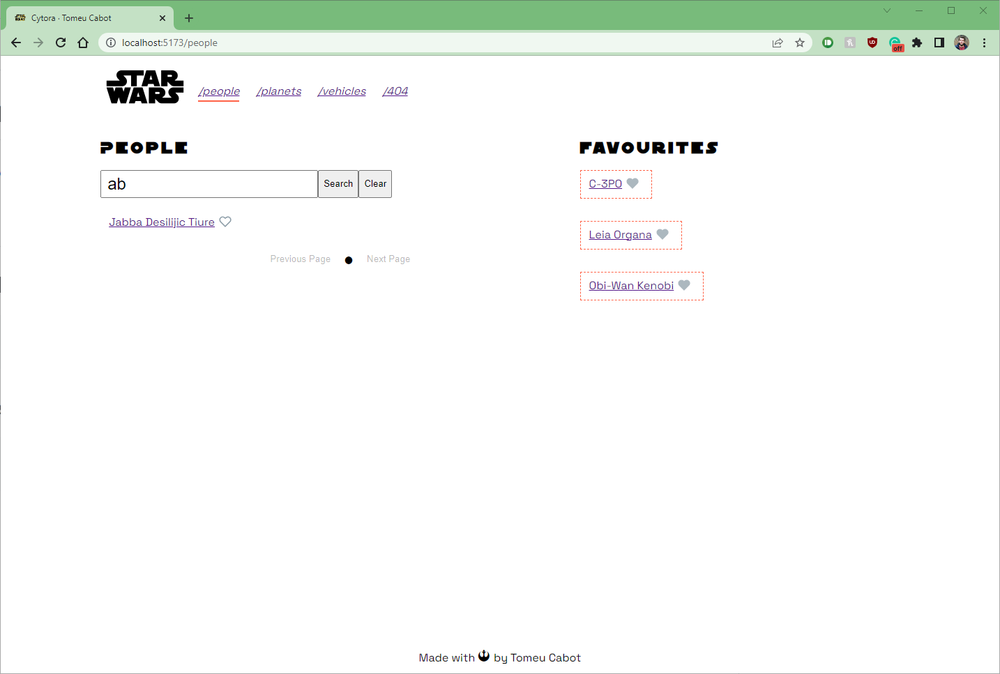
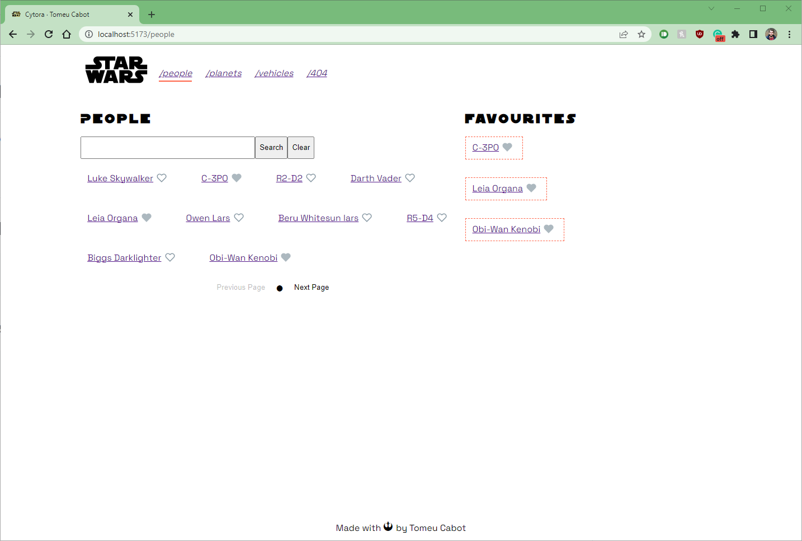
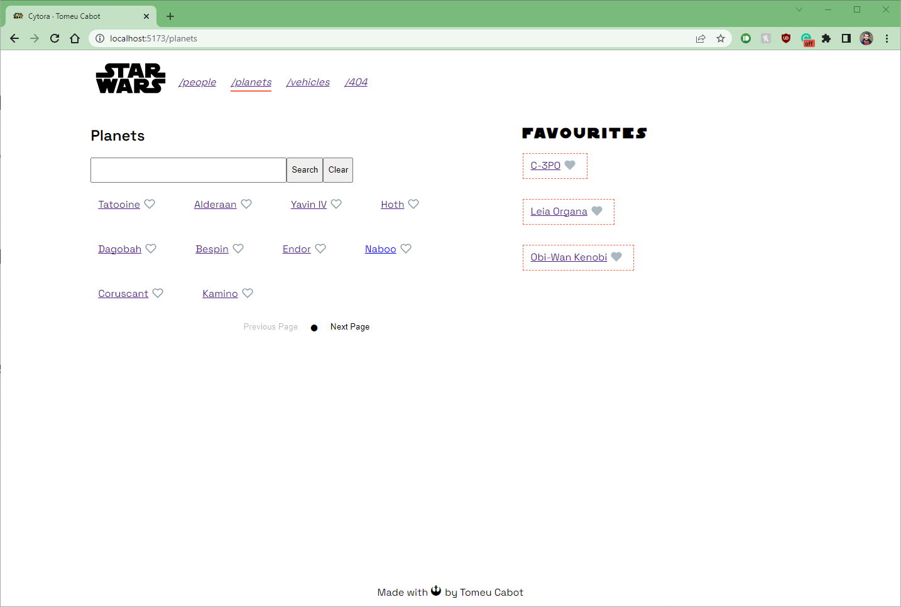
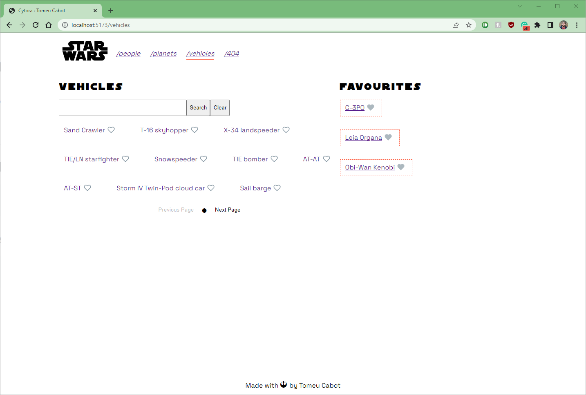
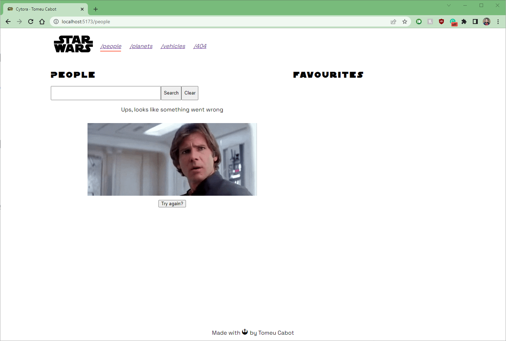
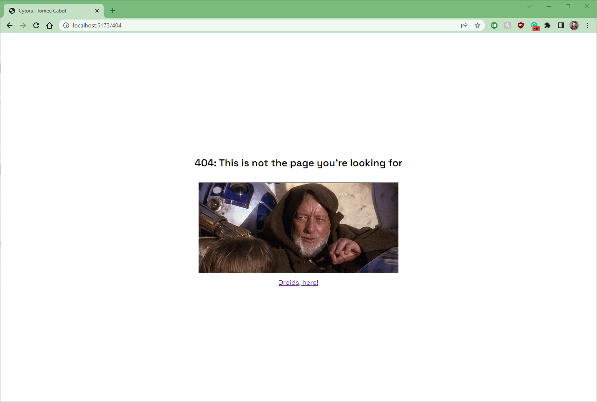

# cytora.com - Frontend Interview

> URL preview: https://tc-cytora-frontend-challenge.netlify.app/

## Get Started

### 📚 Install dependencies

```bash
$ npm install
```

### 🚀 Lunch the site!

```bash
$ npm run dev
```

### 🧠 Quick notes

I decided to use [React](https://reactjs.org/) since I feel comfortable with it. For state management I believe this could be accomplished with in-build tools like `React.Context` but for the sake of learning I wanted to test out [Zustand](https://github.com/pmndrs/zustand) and I was impressed with how well it works and easy it is to setup. I didn't want to mess up with any CSS framework, even tho I like TailwindCSS I thought it was overkilling for just a few classes I wanted to use.
The most challenging in the project was caching requests, even if I used [React Query](https://tanstack.com/query/v4/docs/overview) in the past it was always revalidating data so I had to search for something else, after finding out about this cache adapter it was good enough for this example. In the Technical specification, it says "client-side caching (LRU) of request" which usually means to have a "capacity" of caching, and since it is not defined I decided that it was good enough.
I spent one and a half days on it, primarily handling styling since I do not have a real design in mind and I thought to move stuff all time around.
As you can check in the #Improvements section there is plenty of improvements, fixes, and features to implement if I could dedicate even more time. I would like to mention that testing is really important to me and I would like to have tested much more but I didn't want to invest a week in a code challenge.

### 🛠 Tools

- [React](https://reactjs.org/)
- [Typescript](https://www.typescriptlang.org/)
- [Vite](https://vitejs.dev/)
- [Axios](https://axios-http.com/) HTTP client
- [axios-cache-adapter](https://github.com/RasCarlito/axios-cache-adapter) Caching adapter for axios.
- [localforage](https://github.com/localForage/localForage) Wrapper for localStorage, IndexedDB...
- [Zustand](https://github.com/pmndrs/zustand) state management

### 📸 Screenshots

|                                               |                                               |
| --------------------------------------------- | --------------------------------------------- |
|               |          |
|               |  |
|           |         |
|  |                        |

### 🖊 Improvements

- reliability: e2e + unit testing
- refactor: every list view is quite similar, even the hooks. Try to abstract it to reduce loc.
- feat: keep in sync search with url so it persist the state if we reload the page
- feat: mobile view / responsive
- feat: add species, films category
- feat: persist favourites in localStorage
- fix: investiage / use react suspense to show less spinners
- performance: instead of loading entity and afterwards fetch their properties, fetch everything before load entity
- performance: load only necessary fonts and weights
- feat: show an image together with the name
- style: add styling to buttons

### 🧪 Coverage

```

 ✓ src/utils/utils.test.ts (2)
 ✓ src/services/test/peopleService.test.ts (1)
 ✓ src/components/Header/Header.test.tsx (1)
 ✓ src/hooks/test/usePeople.test.ts (2) 420ms
 ✓ src/components/LikeableItem/LikeableItem.test.tsx (3) 725ms
 ✓ src/pages/People/People.test.tsx (1) 543ms

Test Files  6 passed (6)
     Tests  10 passed (10)
  Start at  17:48:39
  Duration  12.27s (transform 2.38s, setup 1.70s, collect 6.23s, tests 1.92s)

 % Coverage report from c8
-----------------------------|---------|----------|---------|---------|-------------------
File                         | % Stmts | % Branch | % Funcs | % Lines | Uncovered Line #s
-----------------------------|---------|----------|---------|---------|-------------------
All files                    |   77.94 |    92.15 |   65.45 |   77.94 |
 src                         |     100 |      100 |     100 |     100 |
  setupTests.ts              |     100 |      100 |     100 |     100 |
 src/components/ErrorLoading |   57.69 |      100 |       0 |   57.69 |
  ErrorLoading.tsx           |      56 |      100 |       0 |      56 | 15-25
  index.ts                   |     100 |      100 |       0 |     100 |
 src/components/Header       |     100 |      100 |     100 |     100 |
  Header.tsx                 |     100 |      100 |     100 |     100 |
 src/components/HeartButton  |     100 |      100 |     100 |     100 |
  HeartButton.tsx            |     100 |      100 |     100 |     100 |
  index.ts                   |     100 |      100 |     100 |     100 |
 src/components/Icons/Heart  |     100 |      100 |     100 |     100 |
  Heart.tsx                  |     100 |      100 |     100 |     100 |
  index.ts                   |     100 |      100 |     100 |     100 |
 src/components/LikeableItem |     100 |      100 |     100 |     100 |
  LikeableItem.tsx           |     100 |      100 |     100 |     100 |
  index.ts                   |     100 |      100 |     100 |     100 |
 src/components/Loading      |   66.66 |      100 |       0 |   66.66 |
  Loading.tsx                |      60 |      100 |       0 |      60 | 4-5
  index.ts                   |     100 |      100 |       0 |     100 |
 src/components/Pagination   |     100 |      100 |     100 |     100 |
  Pagination.tsx             |     100 |      100 |     100 |     100 |
  index.ts                   |     100 |      100 |     100 |     100 |
 src/components/Search       |   82.92 |      100 |      75 |   82.92 |
  Search.tsx                 |    82.5 |      100 |   66.66 |    82.5 | 12-18
  index.ts                   |     100 |      100 |     100 |     100 |
 src/domain                  |     100 |      100 |     100 |     100 |
  Route.ts                   |     100 |      100 |     100 |     100 |
 src/hooks                   |   51.74 |     92.3 |   63.63 |   51.74 |
  useAllPeople.ts            |   12.85 |      100 |      50 |   12.85 | 9-69
  useFavourite.ts            |   73.68 |       75 |   66.66 |   73.68 | 8-9,14-16
  useFavouritesStore.ts      |   85.71 |      100 |   33.33 |   85.71 | 18-20
  usePeople.ts               |     100 |      100 |     100 |     100 |
 src/pages/PageLoading       |   45.45 |      100 |       0 |   45.45 |
  PageLoading.tsx            |      40 |      100 |       0 |      40 | 5-10
  index.ts                   |     100 |      100 |       0 |     100 |
 src/pages/People            |     100 |       50 |     100 |     100 |
  People.tsx                 |     100 |       50 |     100 |     100 | 19-20
 src/services                |   92.68 |      100 |      80 |   92.68 |
  api.ts                     |     100 |      100 |     100 |     100 |
  peopleService.ts           |   84.21 |      100 |      75 |   84.21 | 16-18
 src/test                    |     100 |      100 |     100 |     100 |
  utils.tsx                  |     100 |      100 |     100 |     100 |
 src/utils                   |      65 |      100 |   33.33 |      65 |
  index.ts                   |      65 |      100 |   33.33 |      65 | 12-17,20
-----------------------------|---------|----------|---------|---------|-------------------
```
